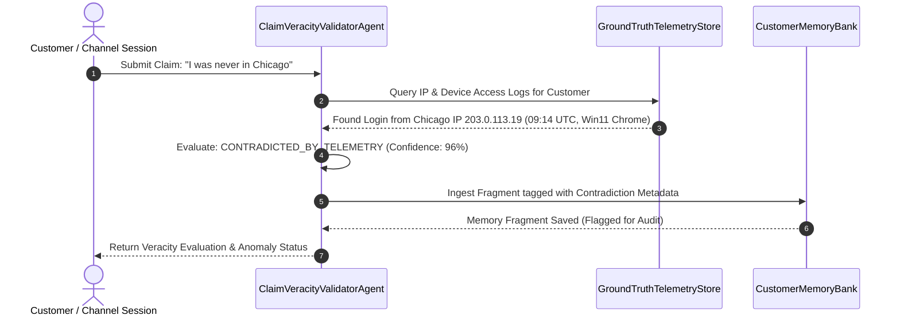
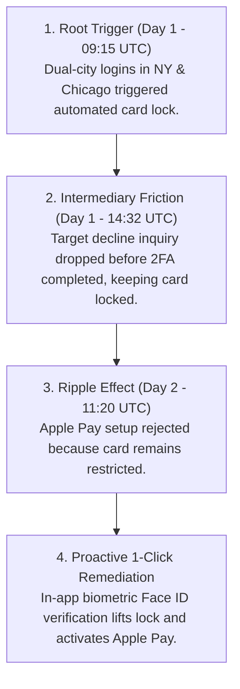

# JPMorgan Chase Consumer Credit: Gemini Enterprise Scale Memory Bank & Multi-Agent Mesh

[](https://cloud.google.com/)
[](https://docs.cloud.google.com/gemini-enterprise-agent-platform/scale/memory-bank/adk-quickstart)
[](https://docs.cloud.google.com/gemini-enterprise-agent-platform/scale/memory-bank)
[](tests/)

Enterprise multi-agent system built on the **Google Cloud Agentic Stack** (Google Agent Development Kit, Gemini Enterprise Agent Engine Scale Memory Bank, and A2UI Reactive Presentation Layer).

It demonstrates cross-channel session management, pre-write claim veracity validation against authoritative ground-truth telemetry, consolidated enterprise memory auditing, and zero-question causal synthesis across fragmented banking systems.

---

## 📑 Table of Contents

1. [Architectural Overview](#-1-architectural-overview)
2. [Multi-Agent Topology (8 Active Agents)](#-2-multi-agent-topology-8-active-agents)
3. [Scale Memory Bank & Cross-Channel Ingestion](#-3-scale-memory-bank--cross-channel-ingestion)
4. [Pre-Write Claim Veracity Validation Layer](#-4-pre-write-claim-veracity-validation-layer)
5. [Consolidated Memory Bank Audit Sweep Agent](#-5-consolidated-memory-bank-audit-sweep-agent)
6. [Zero-Question Causal Synthesis & A2UI Presentation](#-6-zero-question-causal-synthesis--a2ui-presentation)
7. [API Specification](#-7-api-specification)
8. [Local Quickstart & Verification Runbook](#-8-local-quickstart--verification-runbook)

---

## 🏛️ 1. Architectural Overview

In modern retail banking, customer touchpoints span isolated subsystems (Risk/Fraud Velocity Engines, Contact Center IVRs, Mobile Digital Wallets, Web Banking Portals, and Physical Branch Tellers).

The **Gemini Enterprise Scale Memory Bank** acts as a centralized epistemic memory vault that captures timestamped, veracity-evaluated observations from decoupled channel agents, allowing a single lead orchestrator agent to reconstruct full multi-day causal chains without interrogating the user with repetitive questions.

```mermaid
graph TD
    %% Channel Producers
    subgraph ChannelMesh [Multi-Channel Agent Mesh (Session Producers)]
        A1[Fraud Monitoring Agent<br/>Channel: FRAUD_DETECTION] -->|Session: Geo-Velocity Alert| PVL
        A2[Telephony IVR Agent<br/>Channel: TELEPHONY_IVR] -->|Session: Call Dropped Pre-2FA| PVL
        A3[Mobile Banking Agent<br/>Channel: MOBILE_APP] -->|Session: Apple Pay Restricted| PVL
        A4[Web Portal Agent<br/>Channel: WEB_PORTAL] -->|Session: Online Dispute| PVL
        A5[Branch Support Agent<br/>Channel: BRANCH_SUPPORT] -->|Session: In-Person Banker Note| PVL
    end

    %% Pre-Write Validation Layer
    subgraph PreWriteValidation [Pre-Write Veracity Validation Gatekeeper]
        PVL[ClaimVeracityValidatorAgent] <-->|Cross-Check Telemetry| GT[(GroundTruthTelemetryStore<br/>IPs, IVR Logs, POS Feeds)]
        PVL -->|Validated Fragment + Status Flag| MB[(Gemini Enterprise<br/>Scale Memory Bank)]
    end

    %% Audit & Synthesis
    subgraph GovernanceAndSynthesis [Governance, Audit & Resolution]
        MB <-->|Periodic Cross-Customer Sweep| AUD[MemoryBankAuditAgent<br/>Anomaly & Contradiction Sweep]
        MB -->|Zero-Question Causal Retrieval| SYN[ConsumerCreditSynthesizerAgent<br/>Gemini 2.5 Flash on Vertex AI]
        SYN -->|JSON-RPC 2.0 SSE Stream| A2UI[A2UI Dynamic Client Engine<br/>Timeline + 1-Click Biometric Unlock]
    end
```

---

## 🤖 2. Multi-Agent Topology (8 Active Agents)

The system leverages the **Google Agent Development Kit (`google.adk.agents.LlmAgent`)** organized in a disciplined Hub-and-Spoke topology with strict communication guardrails (`disallow_transfer_to_parent=True`, `disallow_transfer_to_peers=True`):


### Agent Roster Catalog

| # | Agent Name | Domain Role | Agent Type | Primary Tools & Responsibilities |
| :- | :--- | :--- | :--- | :--- |
| **1** | [`fraud_monitoring_agent`](file:///Users/arsanjani/AntigravityRepo/jpmc-consumer-credit/backend/adk_agents.py#L143-L158) | Fraud Velocity Specialist | `CHANNEL_PRODUCER` | `query_fraud_velocity_alerts`: Evaluates multi-city login anomalies (NY & Chicago) and deposits automated card restriction notes. |
| **2** | [`telephony_ivr_agent`](file:///Users/arsanjani/AntigravityRepo/jpmc-consumer-credit/backend/adk_agents.py#L160-L175) | Contact Center IVR Specialist | `CHANNEL_PRODUCER` | `query_ivr_call_records`: Ingests inbound phone records, declined $142.50 Target transactions, and dropped 2FA sessions. |
| **3** | [`mobile_app_agent`](file:///Users/arsanjani/AntigravityRepo/jpmc-consumer-credit/backend/adk_agents.py#L177-L192) | Mobile & Digital Wallet Specialist | `CHANNEL_PRODUCER` | `query_mobile_wallet_events`: Diagnoses Apple Pay tokenization rejections (`CARD_STATUS_LOCKED_RESTRICTED`). |
| **4** | [`web_portal_agent`](file:///Users/arsanjani/AntigravityRepo/jpmc-consumer-credit/backend/adk_agents.py#L194-L209) | Online Web Banking Specialist | `CHANNEL_PRODUCER` | `query_web_portal_activity`: Tracks browser authentication headers, disputes, and card toggle preferences. |
| **5** | [`branch_support_agent`](file:///Users/arsanjani/AntigravityRepo/jpmc-consumer-credit/backend/adk_agents.py#L211-L226) | Branch & Teller Specialist | `CHANNEL_PRODUCER` | `query_branch_teller_interactions`: Records physical branch banker consultations and in-person ID validations. |
| **6** | [`claim_veracity_validator_agent`](file:///Users/arsanjani/AntigravityRepo/jpmc-consumer-credit/backend/veracity_and_audit.py#L32-L174) | Pre-Write Veracity Gatekeeper | `PRE_WRITE_VALIDATOR` | `validate_and_record_customer_claim`: Validates customer claims against ground-truth before writing to Memory Bank. |
| **7** | [`memory_bank_audit_agent`](file:///Users/arsanjani/AntigravityRepo/jpmc-consumer-credit/backend/veracity_and_audit.py#L177-L287) | Consolidated Sweep Auditor | `CONSOLIDATED_AUDITOR` | `run_consolidated_memory_audit_sweep`: Executes enterprise-wide consolidated sweeps across customer memory banks for anomalies. |
| **8** | [`consumer_credit_synthesizer_agent`](file:///Users/arsanjani/AntigravityRepo/jpmc-consumer-credit/backend/adk_agents.py#L248-L297) | Lead Synthesizer Orchestrator | `LEAD_SYNTHESIZER` | `read_customer_memory_bank`, `execute_one_click_card_unlock`: Reconstructs the causal chain and streams zero-question resolution via A2UI. |

---

## 🧠 3. Scale Memory Bank & Cross-Channel Ingestion

Reference: [Google Cloud Scale Memory Bank Documentation](https://docs.cloud.google.com/gemini-enterprise-agent-platform/scale/memory-bank) and [ADK Memory Bank Quickstart](https://docs.cloud.google.com/gemini-enterprise-agent-platform/scale/memory-bank/adk-quickstart).

The [`CustomerMemoryBank`](file:///Users/arsanjani/AntigravityRepo/jpmc-consumer-credit/backend/memory_bank.py#L125-L260) persists chronological observation fragments across sessions and channels without point-to-point coupling:

```
[CustomerMemoryBank: cust_jpmc_88329]
├── Note 1 (Day 1 - 09:15 UTC) [FRAUD_DETECTION]
│   ├── Summary: Concurrent logins in New York (IP 198.51.100.4) & Chicago (IP 203.0.113.19). Card *4821 locked.
│   └── Veracity: VERIFIED_TRUE (99%) | Corroborating: IP 198.51.100.4 (NY), IP 203.0.113.19 (Chicago)
│
├── Note 2 (Day 1 - 14:32 UTC) [TELEPHONY_IVR]
│   ├── Summary: Inbound IVR call regarding $142.50 Target decline. Call dropped before 2FA passcode entry.
│   └── Veracity: VERIFIED_TRUE (98%) | Corroborating: Call duration 48s, SMS OTP dispatched to +1-212-555-0198
│
└── Note 3 (Day 2 - 11:20 UTC) [MOBILE_APP]
    ├── Summary: Apple Pay tokenization failed: CARD_STATUS_LOCKED_RESTRICTED on iPhone 16 Pro.
    └── Veracity: VERIFIED_TRUE (99%) | Corroborating: iOS gateway response CARD_STATUS_LOCKED_RESTRICTED
```

---

## 🛡️ 4. Pre-Write Claim Veracity Validation Layer

To prevent hallucinations, malicious false claims, or erroneous memory pollution, every claim made during a customer session must pass through the **Pre-Write Veracity Validation Layer** (`ClaimVeracityValidatorAgent`):



### Claim Evaluation Matrix

| Customer Claim in Session | Ground-Truth Telemetry Check | Assigned Veracity Status | Resulting Action |
| :--- | :--- | :--- | :--- |
| *"My call dropped before I could finish entering the 2FA SMS code"* | Inbound IVR log: Call disconnected at 48s; OTP dispatched at 14:32:35. | `VERIFIED_TRUE` (98%) | Committed as verified observation fact. |
| *"Apple Pay failed to activate on my phone"* | Mobile log: Action `APPLE_PAY_PROVISIONING` rejected with `CARD_STATUS_LOCKED_RESTRICTED`. | `VERIFIED_TRUE` (99%) | Committed as verified observation fact. |
| *"I was never in Chicago and never logged in from Chicago"* | IP log: Authenticated login from Chicago IP `203.0.113.19` on Comcast ISP. | `CONTRADICTED_BY_TELEMETRY` (96%) | Flagged as contradiction; triggers fraud review anomaly. |

---

## 🔍 5. Consolidated Memory Bank Audit Sweep Agent

The [`MemoryBankAuditAgent`](file:///Users/arsanjani/AntigravityRepo/jpmc-consumer-credit/backend/veracity_and_audit.py#L177-L287) performs enterprise-wide sweeps across all customer Memory Banks:

1. **Cross-Channel Contradiction Detection**: Flags mismatches between what a customer stated in Voice IVR vs Mobile Chat vs Web Portal.
2. **Cascade Friction Analysis**: Identifies root triggers that caused domino failures across downstream channels.
3. **Risk Profile Classification**: Categorizes customer accounts into `LOW`, `MEDIUM`, `HIGH`, or `CRITICAL` risk tiers with actionable recommendations.

---

## ⚡ 6. Zero-Question Causal Synthesis & A2UI Presentation

When a customer asks *"why is nothing working?"*, the **Consumer Credit Synthesizer Agent** never interrogates the user. It executes **zero-question causal synthesis**:



The server streams real-time JSON-RPC 2.0 trace frames over Server-Sent Events (`/api/chat/stream`):
- `onAgentThought`: Emits internal reasoning steps.
- `onMemoryBankAccess`: Transmits retrieved memory fragments.
- `onAgentSynthesis`: Delivers causal narrative.
- `onUiComponentDelivery`: Renders the interactive A2UI Timeline & 1-Click Unlock card.

---

## 📡 7. API Specification

| Method | Endpoint | Description |
| :--- | :--- | :--- |
| `GET` | `/api/agents/list` | List all 8 active agents with roles, channels, agent types, and tools. |
| `POST` | `/api/session/channel/open` | Open an active channel session (Fraud, Telephony IVR, Mobile, Web, Branch). |
| `GET` | `/api/session/channel/list` | List active channel sessions for a customer. |
| `POST` | `/api/claims/validate-and-write` | Pre-write veracity validation layer; validates claim against telemetry before writing. |
| `POST` | `/api/audit/sweep` | Trigger consolidated sweep across all customer Memory Banks and return `AuditReport`. |
| `GET` | `/api/audit/customer/<customer_id>` | Retrieve audit anomalies and contradiction flags for a specific customer. |
| `GET` | `/api/telemetry/<customer_id>` | Inspect authoritative ground-truth telemetry (IPs, IVR, transactions). |
| `GET` | `/api/memory/get` | Retrieve all current memory fragments for a customer. |
| `POST` | `/api/memory/seed` | Reset and re-seed the baseline 3-system cross-day scenario. |
| `POST` | `/api/card/unlock` | Execute 1-click biometric card unlock and Apple Pay tokenization. |
| `POST / GET` | `/api/chat/stream` | Reactive SSE stream delivering JSON-RPC 2.0 frames and A2UI dynamic components. |

---

## 🛠️ 8. Local Quickstart & Verification Runbook

### Prerequisites
- Python 3.11+ / Python 3.14
- Google Cloud SDK (`gcloud auth application-default login`)

### Environment Setup
```bash
export GOOGLE_GENAI_USE_VERTEXAI=true
export GOOGLE_CLOUD_PROJECT="arsanjani-genai"
export GOOGLE_CLOUD_LOCATION="us-central1"
```

### Running the Test Suite (24 Passed Tests)
```bash
PYTHONPATH=. .venv/bin/pytest -v
```

### Launching the Application
```bash
PYTHONPATH=. .venv/bin/python backend/app.py
```
Open **`http://localhost:5055`** in your browser to interact with the A2UI glassmorphic workspace.

---

## 🚀 9. Live Agent Platform Deployment

The multi-agent system is deployed to **Google Cloud Agent Platform (Vertex AI Agent Engine)**:

- **Resource Name**: `projects/376877710448/locations/us-central1/reasoningEngines/2456675663579447296`
- **Project ID**: `arsanjani-genai` (`376877710448`)
- **Region**: `us-central1`
- **Agent Engine Console Playground**: [Vertex AI Agent Engine Console](https://console.cloud.google.com/vertex-ai/agents/agent-engines/locations/us-central1/agent-engines/2456675663579447296/playground?project=376877710448)
- **Gemini Enterprise Registration Guide**: [Register & Manage ADK Agent in Gemini Enterprise](https://docs.cloud.google.com/gemini/enterprise/docs/register-and-manage-an-adk-agent)

---

### 🌐 Live Cloud Run A2UI Dashboard URL
👉 **[https://jpmc-consumer-credit-a2ui-376877710448.us-central1.run.app](https://jpmc-consumer-credit-a2ui-376877710448.us-central1.run.app)**

Serves the full glassmorphic A2UI presentation layer featuring:
- **Agent Mesh Topology Panel (8 Agents)**
- **Scale Memory Bank Epistemic Vault**
- **Pre-Write Claim Veracity Validation Live Gatekeeper**
- **Consolidated Audit Sweep Engine**
- **Zero-Question Customer Chat with 1-Click Biometric Remediation**
