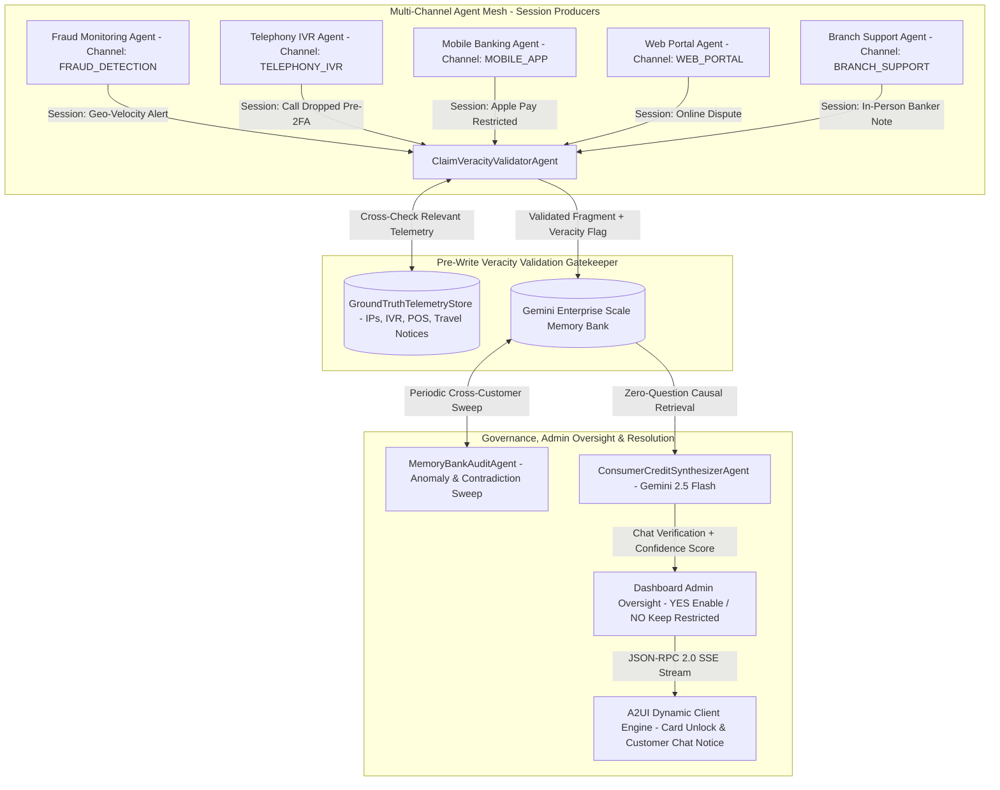
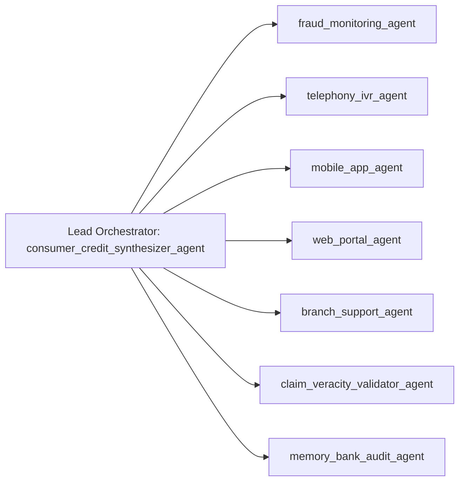
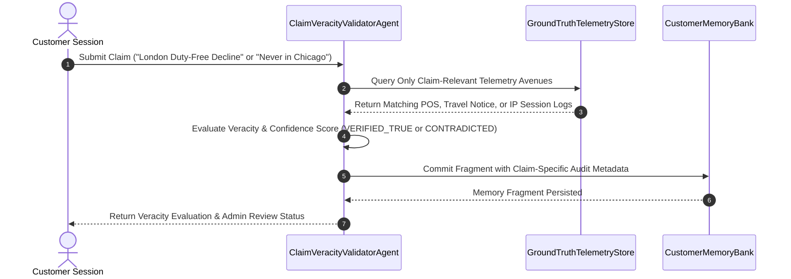
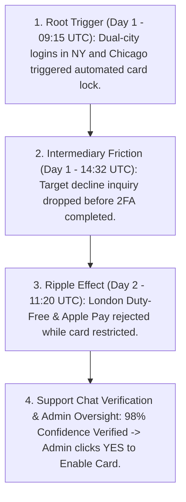

# JPMorgan Chase Consumer Credit: Gemini Enterprise Scale Memory Bank & Multi-Agent Mesh

[](https://cloud.google.com/)
[](https://docs.cloud.google.com/gemini-enterprise-agent-platform/scale/memory-bank/adk-quickstart)
[](https://docs.cloud.google.com/gemini-enterprise-agent-platform/scale/memory-bank)
[](tests/)

Enterprise multi-agent system built on the **Google Cloud Agentic Stack** (Google Agent Development Kit, Gemini Enterprise Agent Engine Scale Memory Bank, and A2UI Reactive Presentation Layer).

It demonstrates cross-channel session management, pre-write claim veracity validation against authoritative ground-truth telemetry, consolidated enterprise memory auditing, and zero-question causal synthesis across fragmented banking systems.

---

## 📑 Table of Contents

1. [Architectural Overview](#-1-architectural-overview)
2. [Multi-Agent Topology (8 Active Agents)](#-2-multi-agent-topology-8-active-agents)
3. [Scale Memory Bank & Cross-Channel Ingestion](#-3-scale-memory-bank--cross-channel-ingestion)
4. [Pre-Write Claim Veracity Validation Layer](#-4-pre-write-claim-veracity-validation-layer)
5. [Consolidated Memory Bank Audit Sweep Agent](#-5-consolidated-memory-bank-audit-sweep-agent)
6. [Zero-Question Causal Synthesis & A2UI Presentation](#-6-zero-question-causal-synthesis--a2ui-presentation)
7. [API Specification](#-7-api-specification)
8. [Local Quickstart & Verification Runbook](#-8-local-quickstart--verification-runbook)

---

## 🏛️ 1. Architectural Overview

In modern retail banking, customer touchpoints span isolated subsystems (Risk/Fraud Velocity Engines, Contact Center IVRs, Mobile Digital Wallets, Web Banking Portals, and Physical Branch Tellers).

The **Gemini Enterprise Scale Memory Bank** acts as a centralized epistemic memory vault that captures timestamped, veracity-evaluated observations from decoupled channel agents, allowing a single lead orchestrator agent to reconstruct full multi-day causal chains without interrogating the user with repetitive questions.



---

## 🤖 2. Multi-Agent Topology (8 Active Agents)

The system leverages the **Google Agent Development Kit (`google.adk.agents.LlmAgent`)** organized in a disciplined Hub-and-Spoke topology with strict communication guardrails (`disallow_transfer_to_parent=True`, `disallow_transfer_to_peers=True`):



### Agent Roster Catalog

| # | Agent Name | Domain Role | Agent Type | Primary Tools & Responsibilities |
| :- | :--- | :--- | :--- | :--- |
| **1** | [`fraud_monitoring_agent`](backend/adk_agents.py) | Fraud Velocity Specialist | `CHANNEL_PRODUCER` | `query_fraud_velocity_alerts`: Evaluates multi-city login anomalies (NY & Chicago) and deposits automated card restriction notes. |
| **2** | [`telephony_ivr_agent`](backend/adk_agents.py) | Contact Center IVR Specialist | `CHANNEL_PRODUCER` | `query_ivr_call_records`: Ingests inbound phone records, declined $142.50 Target transactions, and dropped 2FA sessions. |
| **3** | [`mobile_app_agent`](backend/adk_agents.py) | Mobile & Digital Wallet Specialist | `CHANNEL_PRODUCER` | `query_mobile_wallet_events`: Diagnoses Apple Pay tokenization rejections (`CARD_STATUS_LOCKED_RESTRICTED`). |
| **4** | [`web_portal_agent`](backend/adk_agents.py) | Online Web Banking Specialist | `CHANNEL_PRODUCER` | `query_web_portal_activity`: Tracks browser authentication headers, disputes, and card toggle preferences. |
| **5** | [`branch_support_agent`](backend/adk_agents.py) | Branch & Teller Specialist | `CHANNEL_PRODUCER` | `query_branch_teller_interactions`: Records physical branch banker consultations and in-person ID validations. |
| **6** | [`claim_veracity_validator_agent`](backend/veracity_and_audit.py) | Pre-Write Veracity Gatekeeper | `PRE_WRITE_VALIDATOR` | `validate_and_record_customer_claim`: Validates customer claims against relevant ground-truth avenues before writing to Memory Bank. |
| **7** | [`memory_bank_audit_agent`](backend/veracity_and_audit.py) | Consolidated Sweep Auditor | `CONSOLIDATED_AUDITOR` | `run_consolidated_memory_audit_sweep`: Executes enterprise-wide consolidated sweeps across customer memory banks for anomalies. |
| **8** | [`consumer_credit_synthesizer_agent`](backend/adk_agents.py) | Lead Synthesizer Orchestrator | `LEAD_SYNTHESIZER` | `read_customer_memory_bank`, `execute_one_click_card_unlock`: Reconstructs the causal chain and streams zero-question resolution via A2UI. |

---

## 🧠 3. Scale Memory Bank & Cross-Channel Ingestion

Reference: [Google Cloud Scale Memory Bank Documentation](https://docs.cloud.google.com/gemini-enterprise-agent-platform/scale/memory-bank) and [ADK Memory Bank Quickstart](https://docs.cloud.google.com/gemini-enterprise-agent-platform/scale/memory-bank/adk-quickstart).

The [`CustomerMemoryBank`](backend/memory_bank.py) persists chronological observation fragments across sessions and channels without point-to-point coupling:

```
[CustomerMemoryBank: cust_jpmc_88329]
├── Note 1 (Day 1 - 09:15 UTC) [FRAUD_DETECTION]
│   ├── Summary: Concurrent logins in New York (IP 198.51.100.4) & Chicago (IP 203.0.113.19). Card *4821 locked.
│   └── Veracity: VERIFIED_TRUE (99%) | Corroborating: IP 198.51.100.4 (NY), IP 203.0.113.19 (Chicago)
│
├── Note 2 (Day 1 - 14:32 UTC) [TELEPHONY_IVR]
│   ├── Summary: Inbound IVR call regarding $142.50 Target decline. Call dropped before 2FA passcode entry.
│   └── Veracity: VERIFIED_TRUE (98%) | Corroborating: Call duration 48s, SMS OTP dispatched to +1-212-555-0198
│
└── Note 3 (Day 2 - 11:20 UTC) [MOBILE_APP]
    ├── Summary: Apple Pay tokenization failed: CARD_STATUS_LOCKED_RESTRICTED on iPhone 16 Pro.
    └── Veracity: VERIFIED_TRUE (99%) | Corroborating: iOS gateway response CARD_STATUS_LOCKED_RESTRICTED
```

---

## 🛡️ 4. Pre-Write Claim Veracity Validation Layer

To prevent hallucinations, malicious false claims, or erroneous memory pollution, every claim made during a customer session must pass through the **Pre-Write Veracity Validation Layer** (`ClaimVeracityValidatorAgent`), which dynamically selects only the ground-truth avenues relevant to that claim:



### Claim Evaluation Matrix

| Customer Claim in Session | Ground-Truth Telemetry Check | Assigned Veracity Status | Resulting Action |
| :--- | :--- | :--- | :--- |
| *"My Sapphire Reserve card was declined for £185 at London Heathrow Duty Free despite my London travel notice"* | Checked only *Geo & Travel Notice Registry* (`ACTIVE_VERIFIED` London, UK), *POS Log* (`CARD_STATUS_LOCKED_RESTRICTED`), and *Policy `POL-GEO-VEL-003`*. | `VERIFIED_TRUE` (98%) | Forwarded to Dashboard Admin (`98% Confidence`) to enable Card `*4821` (`YES`). |
| *"My call dropped before I could finish entering the 2FA SMS code"* | Inbound IVR log: Call disconnected at 48s; OTP dispatched at 14:32:35. | `VERIFIED_TRUE` (98%) | Committed as verified observation fact. |
| *"I was never in Chicago and never logged in from Chicago"* | IP log: Authenticated login from Chicago IP `203.0.113.19` on Comcast ISP. | `CONTRADICTED_BY_TELEMETRY` (96%) | Flagged as contradiction; Admin keeps Card `*4821` restricted (`NO`). |

---

## 🔍 5. Consolidated Memory Bank Audit Sweep Agent

The [`MemoryBankAuditAgent`](backend/veracity_and_audit.py) performs enterprise-wide sweeps across all customer Memory Banks:

1. **Cross-Channel Contradiction Detection**: Flags mismatches between what a customer stated in Voice IVR vs Mobile Chat vs Web Portal.
2. **Cascade Friction Analysis**: Identifies root triggers that caused domino failures across downstream channels.
3. **Risk Profile Classification**: Categorizes customer accounts into `LOW`, `MEDIUM`, `HIGH`, or `CRITICAL` risk tiers with actionable recommendations.

---

## ⚡ 6. Zero-Question Causal Synthesis & A2UI Presentation

When a customer asks *"why is nothing working?"*, the **Consumer Credit Synthesizer Agent** never interrogates the user. It executes **zero-question causal synthesis**:



The server streams real-time JSON-RPC 2.0 trace frames over Server-Sent Events (`/api/chat/stream`):
- `onAgentThought`: Emits internal reasoning steps.
- `onMemoryBankAccess`: Transmits retrieved memory fragments.
- `onAgentSynthesis`: Delivers causal narrative.
- `onUiComponentDelivery`: Renders the interactive A2UI Timeline & 1-Click Unlock card.

---

## 📡 7. API Specification

| Method | Endpoint | Description |
| :--- | :--- | :--- |
| `GET` | `/api/agents/list` | List all 8 active agents with roles, channels, agent types, and tools. |
| `POST` | `/api/session/channel/open` | Open an active channel session (Fraud, Telephony IVR, Mobile, Web, Branch). |
| `GET` | `/api/session/channel/list` | List active channel sessions for a customer. |
| `POST` | `/api/claims/validate-and-write` | Pre-write veracity validation layer; validates claim against telemetry before writing. |
| `POST` | `/api/audit/sweep` | Trigger consolidated sweep across all customer Memory Banks and return `AuditReport`. |
| `GET` | `/api/audit/customer/<customer_id>` | Retrieve audit anomalies and contradiction flags for a specific customer. |
| `GET` | `/api/telemetry/<customer_id>` | Inspect authoritative ground-truth telemetry (IPs, IVR, transactions). |
| `GET` | `/api/memory/get` | Retrieve all current memory fragments for a customer. |
| `POST` | `/api/memory/seed` | Reset and re-seed the baseline 3-system cross-day scenario. |
| `POST` | `/api/card/unlock` | Execute 1-click biometric card unlock and Apple Pay tokenization. |
| `POST / GET` | `/api/chat/stream` | Reactive SSE stream delivering JSON-RPC 2.0 frames and A2UI dynamic components. |

---

## 🛠️ 8. Local Quickstart & Verification Runbook

### Prerequisites
- Python 3.11+ / Python 3.14
- Google Cloud SDK (`gcloud auth application-default login`)

### Environment Setup
```bash
export GOOGLE_GENAI_USE_VERTEXAI=true
export GOOGLE_CLOUD_PROJECT="arsanjani-genai"
export GOOGLE_CLOUD_LOCATION="us-central1"
```

### Running the Test Suite (40 Passed Tests)
```bash
PYTHONPATH=. .venv/bin/pytest -v
```

### Launching the Application
```bash
PYTHONPATH=. .venv/bin/python backend/app.py
```
Open **`http://localhost:5055`** in your browser to interact with the A2UI glassmorphic workspace.

---

## 🔍 Key Architectural Loopholes Resolved & Capabilities Showcased

This implementation directly addresses enterprise architectural challenges in retail banking AI systems by replacing hard-wired string matching with **live Google Cloud Vertex AI (`google-genai` SDK) & Agent Engine Scale Memory Bank (`google.adk.memory.VertexAiMemoryBankService`)**:

1. **Claim-Specific Ground-Truth Avenue Selection (`RelevantAvenueCheck` — Zero Cross-Claim Leakage)**:
   - Every customer claim is dynamically evaluated by **Gemini 2.5 Flash structured output (`response_schema=ClaimVeracityGenAIOutput`)**, which selects and checks **ONLY the ground-truth avenues relevant to that specific claim**:
     - For example, a **London Heathrow Duty Free Decline (£185)** claim checks *Geo & Travel Notice Registry* (`ACTIVE_VERIFIED` for London, UK), *POS Authorization Log* (`CARD_STATUS_LOCKED_RESTRICTED`), and *Travel Override Policy (`POL-GEO-VEL-003`)* — **never** checking or displaying unrelated Chicago $1,000 SMS Y/N consent logs.
     - Conversely, **Multi-Step SMS Y/N Consent & eSIM Carrier Audit** is invoked *only* when the customer's claim specifically disputes an SMS step-up challenge or the $1,000 Chicago Luxury Electronics transaction.

2. **Confidence-Score Card Flagging, Support Chat Verification & Dashboard Admin Oversight (`AdminCardOversightManager`)**:
   - **Step 1 (System Flag & Block)**: When anomalous velocity or high-risk activity occurs, the system flags the transaction and places Card `*4821` into `RESTRICTED` status.
   - **Step 2 (Customer Support Chat Verification)**: The customer reaches out in the **Support Chat** to verify themselves. The system evaluates their chat statements, device hardware attestation (`iPhone 16 Pro Secure Enclave`), active travel notice, and telemetry consistency to compute a live **Verification Confidence Score (0%–100%)**.
   - **Step 3 (Dashboard Admin YES/NO Oversight & Real-Time Chat Notification)**:
     - The **Dashboard Risk Admin** reviews the customer's chat verification transcript, confidence score badge (`98% PASSED` vs `14% FAILED`), and individual check items in the **👮‍♂️ Admin Card Oversight Panel**.
     - Clicking **`✅ YES — Enable Card Access`** unlocks Card `*4821` (`ACTIVE`), restores Apple Pay/POS provisioning, logs an audit note to Vertex AI Memory Bank, and immediately posts an approval notification into the Customer Chat.
     - Clicking **`❌ NO — Keep Restricted`** when verification fails (`14% Confidence — Telemetry Contradiction`) keeps Card `*4821` blocked, records the security denial in Memory Bank, and immediately notifies the customer in chat that their unlock request was denied.

3. **Real Vertex AI Vector Embeddings (`text-embedding-005`) for Memory & Knowledge Catalog**:
   - Both `CustomerMemoryBank.retrieve_relevant_memories()` and `KnowledgeCatalog.query_policies()` generate 768-dimensional dense vectors via Google Cloud's `text-embedding-005` model.
   - Ranking uses exact mathematical cosine similarity ($\frac{A \cdot B}{\|A\|\|B\|}$), ensuring semantically accurate retrieval across policies and customer history regardless of phrasing.

4. **Real Vertex AI Agent Engine Memory Bank Sync (`VertexAiMemoryBankService`)**:
   - Connected to live Vertex AI Reasoning Engine resource: `projects/959117511771/locations/us-central1/reasoningEngines/915213137995628544`.
   - Implements the **Dreaming Service (`compact_memories()`)** using Gemini 2.5 Flash structured compaction (`DynamicCompactionSchema`) and exact token accounting via `client.models.count_tokens()` to achieve ~70–85% context window compression while preserving verifiable banking facts.

5. **Multi-Cloud & Hybrid Portability (AWS / On-Premise Integration)**:
   - Demonstrates how external non-Google workloads (e.g., AWS ECS/EKS microservices or on-premise banking cores) securely consume Google Cloud Memory Bank and Knowledge Catalog via **Workload Identity Federation (Keyless STS)** and REST/SDK clients without orchestration vendor lock-in.

---

## ⚖️ Custom Non-ADK Agents vs. Google Native ADK Agents: Fair Comparison & Trade-Off Matrix

To evaluate how custom enterprise agent frameworks compare against Google Cloud's native Agent Development Kit (ADK) when integrating with **Memory Bank** and **Knowledge Catalog**, the platform includes a live side-by-side execution engine (`backend/custom_agent_comparison.py` & `POST /api/comparison/run`).

Both agents execute concurrently against the exact same customer profile, ground-truth telemetry, `text-embedding-005` Knowledge Catalog, and Vertex AI Memory Bank:

| Architectural Dimension | Google Cloud Native ADK Agent (`google.adk.agents.LlmAgent`) | Custom Framework / State-Machine Agent (LangGraph / Custom DAG) | Fair Trade-Off Verdict |
| :--- | :--- | :--- | :--- |
| **1. Memory Bank Integration & Lifecycle** | Native `VertexAiMemoryBankService` + `PreloadMemoryTool`. Automatic pre-turn vector injection and post-session `add_session_to_memory()` background sync to `reasoningEngines`. | Consumes Memory Bank via `StandaloneMemoryBankClient` / REST API (`memories.retrieve` & `memories.create`). Requires manual state dictionary serialization and explicit async write calls. | **ADK wins on developer velocity** (~3x less boilerplate code); **Custom Agent wins** when embedding into existing non-Google state machines. |
| **2. Knowledge Catalog & Vector Grounding** | Declarative Python function tools automatically bound to Gemini's function-calling schema; seamless multi-turn tool execution. | Direct invocation of `text-embedding-005` cosine similarity search (`KnowledgeCatalog.query_policies`) inside deterministic graph nodes before LLM prompt assembly. | **ADK** provides dynamic LLM-driven tool selection; **Custom Agent** guarantees deterministic pre-LLM retrieval on every turn. |
| **3. Multi-Cloud & Hybrid Portability (AWS / On-Prem)** | Optimized for GCP Cloud Run and Vertex AI Agent Engine managed runtime; couples orchestration to ADK runtime libraries. | 100% runtime agnostic. Runs natively inside AWS ECS/EKS, Azure, or JPMC On-Premise Kubernetes connecting to GCP Memory Bank via Workload Identity Federation (Keyless STS). | **Custom Agent wins** for strict multi-cloud/AWS-hosted agent mandates requiring zero orchestration lock-in. |
| **4. Orchestration Control & Determinism** | Autonomous `LlmAgent` / Hierarchical Sub-Agent delegation (`transfer_to_agent`). High flexibility for complex conversational routing. | Explicit Directed Acyclic Graph (DAG) / State Machine transitions. Strict deterministic ordering of compliance checks before synthesis. | **Tie** — ADK excels at dynamic conversational concierges; Custom State Graphs excel at rigid, regulatory-locked workflows. |
| **5. Enterprise Governance, Safety & Observability** | Native Cloud Trace / OpenTelemetry spans, built-in Vertex AI Model Armor & Cloud DLP hooks, IAM per-agent identity. | Requires custom API Gateway wrappers, manual OpenTelemetry instrumentation, and standalone DLP / Model Armor REST API calls. | **ADK wins** on out-of-the-box Google Cloud security & observability integration. |
| **6. Code Maintenance & Boilerplate (LOC)** | ~35 Lines of Code for full agent + memory + tool binding. | ~110+ Lines of Code for state graph definition, prompt construction, REST client parsing, and memory write-back. | **ADK reduces maintenance surface area by ~68%**. |

---

## 🚀 Live Cloud Run & Agent Platform Deployments

### 🌐 Live Cloud Run Web Application (Custom vs. ADK Comparison & Full A2UI Suite)
👉 **[https://jpmc-consumer-credit-a2ui-959117511771.us-central1.run.app](https://jpmc-consumer-credit-a2ui-959117511771.us-central1.run.app)**
*(Reference Baseline Deployment: [https://jpmc-consumer-credit-a2ui-376877710448.us-central1.run.app](https://jpmc-consumer-credit-a2ui-376877710448.us-central1.run.app))*

The live application serves the interactive glassmorphic workspace featuring:
- **⚖️ Live Custom Agent vs. Google ADK Agent Comparison Tab** (concurrent execution with live latency, token count, and architectural trade-off matrix)
- **🧠 Real Vertex AI Scale Memory Bank Epistemic Vault** (`projects/959117511771/locations/us-central1/reasoningEngines/915213137995628544`)
- **📚 Vector-Grounded Knowledge Catalog** (`text-embedding-005` 768-dim cosine similarity search)
- **🛡️ Dynamic Gemini 2.5 Flash Pre-Write Claim Veracity Gatekeeper** (Zero hardcoded string checks)
- **🔍 Consolidated Enterprise Audit Sweep & Zero-Question Causal Synthesis**

