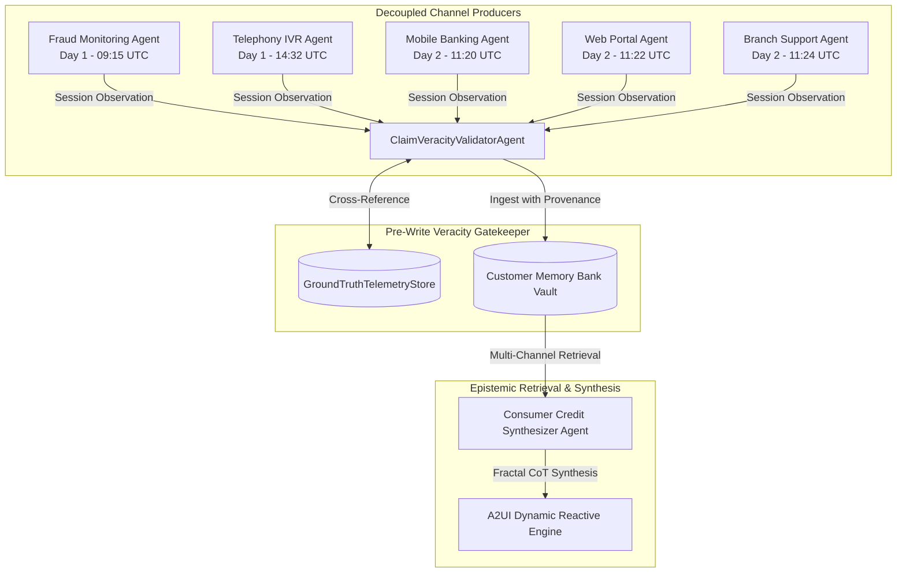
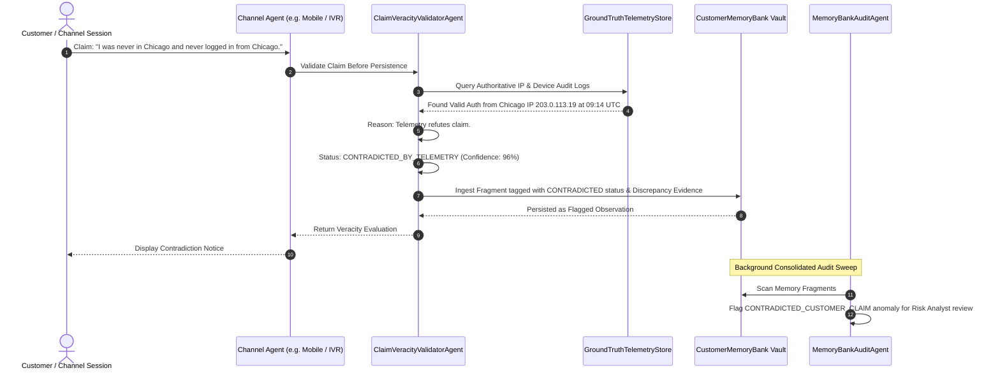
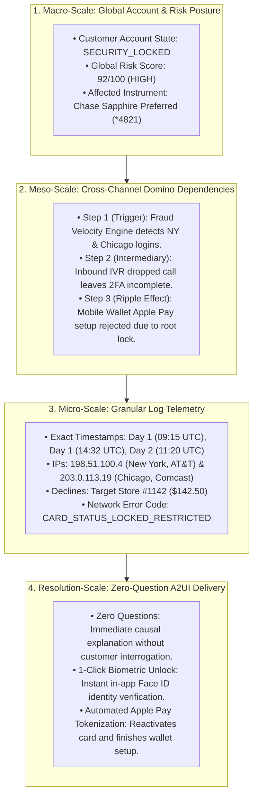
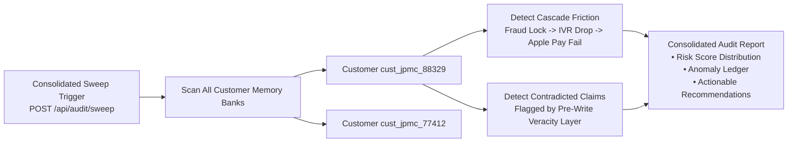

# Gemini Enterprise Scale Memory Bank, Pre-Write Veracity Validation & Fractal Chain-of-Thought Architecture

[](https://cloud.google.com/)
[](https://docs.cloud.google.com/gemini-enterprise-agent-platform/scale/memory-bank/adk-quickstart)
[](https://docs.cloud.google.com/gemini-enterprise-agent-platform/scale/memory-bank)

This technical specification details the enterprise implementation of **Cross-Context Scale Memory Bank**, the **Pre-Write Claim Veracity Validation Layer**, and **Fractal Chain-of-Thought (F-CoT)** multi-scale reasoning for consumer banking on the Google Cloud Agentic Stack.

---

## 📑 Core Architectural Pillars

```
┌─────────────────────────────────────────────────────────────────────────────────┐
│                           JPMORGAN CHASE AGENT PLATFORM                         │
├─────────────────────────┬───────────────────────────┬───────────────────────────┤
│  1. CROSS-CONTEXT       │  2. PRE-WRITE VERACITY    │  3. FRACTAL CHAIN-OF-     │
│     SCALE MEMORY BANK   │     VALIDATION LAYER      │     THOUGHT (F-CoT)       │
│                         │                           │                           │
│  • Multi-channel sync   │  • Pre-write gatekeeper   │  • Macro: Global Risk     │
│  • Epistemic vault      │  • Telemetry cross-check  │  • Meso: Cross-Channel    │
│  • Session decoupling   │  • Anti-hallucination     │  • Micro: Granular Logs   │
│  • Durable persistence  │  • Contradiction tagging  │  • Zero-Question A2UI     │
└─────────────────────────┴───────────────────────────┴───────────────────────────┘
```

---

## 🧠 1. Cross-Context & Cross-Channel Scale Memory Bank

Reference: [Google Cloud Scale Memory Bank Documentation](https://docs.cloud.google.com/gemini-enterprise-agent-platform/scale/memory-bank) & [ADK Quickstart](https://docs.cloud.google.com/gemini-enterprise-agent-platform/scale/memory-bank/adk-quickstart).

In high-concurrency enterprise banking, point-to-point peer-to-peer agent messaging creates $O(N^2)$ network complexity, tight coupling, and context window exhaustion. 

The **Scale Memory Bank** solves this via an **Epistemic Shared Memory Layer**:



### Key Memory Bank Capabilities

1. **Entity-Scoped Persistence**: State is anchored strictly to the customer identifier (`customer_id = "cust_jpmc_88329"`), completely decoupled from individual user sessions or agent runtimes.
2. **Provenance-Aware Chronology**: Every observation fragment records its originating subsystem (`channel`), timestamp, severity, and veracity verification payload.
3. **ADK Native Integration**: Works with `InMemoryMemoryService` for local deterministic testing and scales seamlessly to `VertexAiMemoryBankService` (`google.adk.memory.vertex_ai_memory_bank_service`) and `google.adk.tools.LoadMemoryTool` / `PreloadMemoryTool` for production.

---

## 🛡️ 2. Pre-Write Claim Veracity Validation Layer

A foundational vulnerability of multi-agent LLM architectures is **Memory Contamination**: if an agent writes unverified user statements, customer misconceptions, or deceptive claims into the memory bank as ground facts, subsequent agents will treat them as truth.

The **Pre-Write Veracity Validation Layer** (`ClaimVeracityValidatorAgent`) acts as a mandatory gatekeeper that intercepts all customer claims right before insertion:



### Veracity Status Matrix

| Status | Definition | Telemetry Evidence | Resulting Memory Action |
| :--- | :--- | :--- | :--- |
| `VERIFIED_TRUE` | Corroborated with high certainty by authoritative system records. | IVR call disconnected at 48s; SMS OTP dispatched at 14:32:35; Tokenization returned error code `CARD_STATUS_LOCKED_RESTRICTED`. | Committed to Memory Bank as verified observation fact. |
| `CONTRADICTED_BY_TELEMETRY` | Customer statement is directly contradicted by ground-truth network/carrier/POS telemetry. | Customer claims never logging in from Chicago, but system recorded valid credential auth from Chicago IP `203.0.113.19` (Comcast). | Committed with `CONTRADICTED` tag and discrepancy details; escalated for audit. |
| `UNVERIFIED_PENDING_INVESTIGATION` | Insufficient corroborating records in primary logs. | Claim regarding unrecorded phone call or third-party merchant interaction. | Persisted with unverified status; prevents automated action execution. |
| `SUSPICIOUS_FALSE_CLAIM` | High-confidence fraudulent claim or dispute velocity pattern. | Customer disputes charge while biometric fingerprint authentication was verified at POS. | Suspends 1-click unlock and triggers immediate fraud containment. |

---

## 🔬 3. Fractal Chain-of-Thought (F-CoT) Reasoning Engine

When synthesizing multi-channel memory fragments, traditional models produce disjointed summaries or interrogate the customer with clarifying questions.

The platform uses **Fractal Chain-of-Thought (F-CoT)**, a multi-scale hierarchical reasoning model that inspects facts across Macro, Meso, and Micro organizational scales:



### Fractal CoT Scale Breakdown

1. **Macro-Scale Analysis (Global Risk & Containment)**:
   - Evaluates the holistic customer security state.
   - Recognizes that the entire account friction is driven by a single root restriction (`SECURITY_LOCKED`), not independent isolated outages.

2. **Meso-Scale Analysis (Cross-Channel Domino Trajectory)**:
   - Traces the causal ripple effects across organizational channel boundaries:
     - **Fraud Engine** (Day 1, 09:15 UTC): Root trigger locks card.
     - **Voice IVR** (Day 1, 14:32 UTC): Friction persists because dropped call prevented OTP resolution.
     - **Mobile App** (Day 2, 11:20 UTC): Downstream failure occurs as a direct consequence of the unresolved root lock.

3. **Micro-Scale Analysis (Granular Telemetry Grounding)**:
   - Grounds every causal claim in exact telemetry tokens (IPs, ASN carriers, millisecond timestamps, merchant IDs, dollar amounts, and ISO error codes).

4. **Resolution-Scale Action (Zero-Question Causal Delivery)**:
   - Delivers a comprehensive explanation to the customer *with zero clarifying questions asked*.
   - Renders dynamic A2UI widgets for instant 1-click biometric remediation.

---

## 🔍 4. Consolidated Memory Bank Audit Sweep Agent

The [`MemoryBankAuditAgent`](file:///Users/arsanjani/AntigravityRepo/jpmc-consumer-credit/backend/veracity_and_audit.py#L177-L287) provides cross-customer enterprise memory governance:



### Enterprise Anomaly Classification

- **`CROSS_CHANNEL_CASCADE_FRICTION`**: Root security lock on Day 1 cascaded into Inbound IVR verification failure and Day 2 Apple Pay rejection. Recommended action: Offer in-app 1-Click Biometric Remediation.
- **`CONTRADICTED_CUSTOMER_CLAIM`**: Customer statements refuted by authoritative network or POS telemetry. Recommended action: Route to fraud investigation analyst.
- **`FALSE_CLAIM_PATTERN`**: Multiple contradictory dispute claims filed across channels in rapid succession. Recommended action: Suspend automated digital card unlock.

---

## 📡 5. Enterprise API Architecture

| Method | Route | Description |
| :--- | :--- | :--- |
| `GET` | `/api/agents/list` | Returns catalog of all 8 active agents in the system with roles, channels, tools, and topology. |
| `POST` | `/api/session/channel/open` | Opens an active channel session (Fraud, IVR, Mobile, Web, Branch) for a customer. |
| `GET` | `/api/session/channel/list` | Lists all active channel sessions for a customer. |
| `POST` | `/api/claims/validate-and-write` | **Pre-Write Veracity Validation Layer**: Intercepts claim, checks telemetry, and writes to Memory Bank. |
| `POST` | `/api/audit/sweep` | **Consolidated Audit Sweep**: Audits all customer Memory Banks and returns full `AuditReport`. |
| `GET` | `/api/audit/customer/<id>` | Retrieves audit anomalies and contradiction flags for a specific customer. |
| `GET` | `/api/telemetry/<id>` | Inspects ground-truth network, IVR, and POS transaction telemetry. |
| `GET` | `/api/memory/get` | Retrieves chronological memory fragments for a customer. |
| `POST` | `/api/memory/seed` | Seeds the 3-system cross-day scenario into the Memory Bank. |
| `POST` | `/api/card/unlock` | Executes 1-click biometric identity verification and Apple Pay provisioning. |
| `POST / GET` | `/api/chat/stream` | **Reactive SSE Controller**: Streams JSON-RPC 2.0 trace events and A2UI dynamic components. |

---

## 🧪 6. Test Suite & Verification Matrix

The codebase includes **24 automated unit and integration tests** verifying every layer:

```bash
PYTHONPATH=. .venv/bin/pytest -v
```

```
tests/test_adk_agents.py::test_adk_subagents_instantiation PASSED
tests/test_adk_agents.py::test_list_all_agents_roster PASSED
tests/test_adk_agents.py::test_adk_lead_synthesizer_agent_instantiation PASSED
tests/test_adk_agents.py::test_adk_runner_and_session_initialization PASSED
tests/test_agent.py::test_agent_initialization PASSED
tests/test_agent.py::test_synthesizer_zero_question_narrative_mocked PASSED
tests/test_backend.py::test_session_endpoint PASSED
tests/test_backend.py::test_agents_list_endpoint PASSED
tests/test_backend.py::test_channel_session_open_and_list_endpoints PASSED
tests/test_backend.py::test_claims_validate_and_write_endpoint PASSED
tests/test_backend.py::test_audit_sweep_endpoints PASSED
tests/test_backend.py::test_telemetry_endpoint PASSED
tests/test_backend.py::test_memory_get_and_seed PASSED
tests/test_backend.py::test_stream_endpoint_schema_and_telemetry PASSED
tests/test_memory_bank.py::test_memory_fragment_creation PASSED
tests/test_memory_bank.py::test_customer_memory_bank_seeding PASSED
tests/test_memory_bank.py::test_chronological_ordering PASSED
tests/test_memory_bank.py::test_ingest_custom_fragment PASSED
tests/test_memory_bank.py::test_formatted_memory_context_string PASSED
tests/test_veracity_and_audit.py::test_pre_write_claim_veracity_validation_true_claim PASSED
tests/test_veracity_and_audit.py::test_pre_write_claim_veracity_validation_contradicted_claim PASSED
tests/test_veracity_and_audit.py::test_pre_write_validation_and_write_to_memory_bank PASSED
tests/test_veracity_and_audit.py::test_channel_session_opening_and_tracking PASSED
tests/test_veracity_and_audit.py::test_consolidated_memory_bank_audit_sweep PASSED

======================== 24 passed in 0.45s ========================
```

---

## 💻 7. Local Execution & UI Exploration

```bash
# Set Google Gen AI Enterprise credentials
export GOOGLE_GENAI_USE_VERTEXAI=true
export GOOGLE_CLOUD_PROJECT="arsanjani-genai"
export GOOGLE_CLOUD_LOCATION="us-central1"

# Launch Flask Reactive Controller
PYTHONPATH=. .venv/bin/python backend/app.py
```

Access the UI at `http://localhost:5055` to:
- **Test Pre-Write Veracity**: Enter true vs contradicted claims in the validator panel to observe real-time ground-truth verification.
- **Trigger Consolidated Audit Sweeps**: Click **"Audit Sweep"** to inspect enterprise cross-channel friction anomalies.
- **Experience Zero-Question Causal Synthesis**: Submit *"why is nothing working?"* and experience instant multi-system causal reconstruction with 1-click biometric card unlocking.
