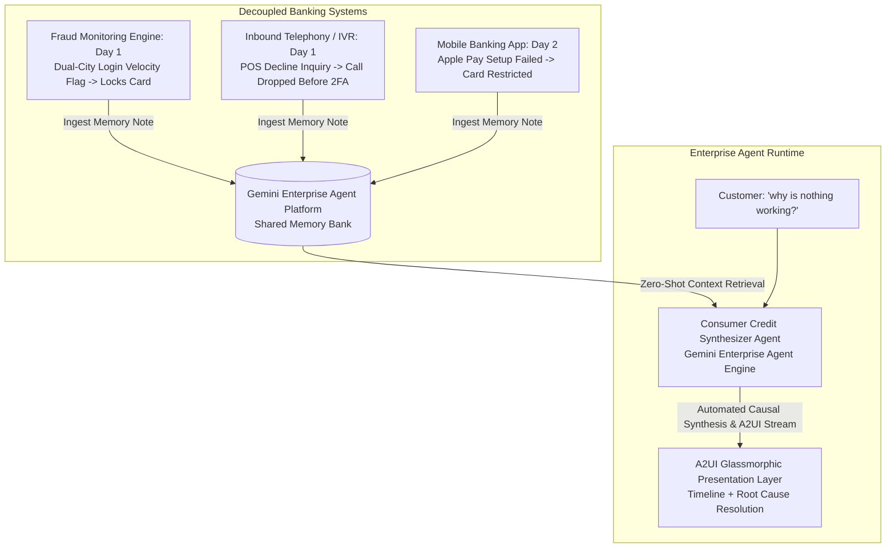

# Multi-System & Multi-Agent Development Guide: Memory Bank & Automated Content Synthesis for Google ADK & A2UI

This guide serves as a definitive playbook for engineering stable, high-performance, and visually stunning multi-system agentic applications using the Google Cloud Agentic Stack (Agent Development Kit, Agent Engine Memory Bank, & Agent UI). 

By adhering to these production-proven best practices and architectural patterns, engineering teams can implement cross-system automated content synthesis where decoupled banking systems feed a shared Memory Bank, enabling a single conversational agent to synthesize fragmented events into complete customer narratives without asking redundant questions.

---

## 1. Architectural Blueprint: Shared Memory Bank & Cross-System Synthesis

In complex enterprise environments like banking, multiple decoupled systems observe customer interactions over time without direct peer-to-peer communication. A centralized **Memory Bank (Shared Epistemic Memory Layer)** captures immutable timestamped observations from each system:



### Decoupled Ingestion & Single-Agent Synthesis
- **Decoupled Producers**: The fraud system, phone line IVR, and mobile banking app write short observation fragments independently into the customer's Memory Bank.
- **Zero-Question Synthesis**: When the customer opens chat asking `"why is nothing working?"`, the single synthesizer agent reads the accumulated Memory Bank notes, reconstructs the cross-day causal chain, and immediately explains the complete story without interrogating the user.

---

## 2. Integration Failure Points & First-Round Corrections

When building custom backend services (such as a Flask or FastAPI server) to run ADK agents and Memory Bank workflows, several core framework integration points must be handled:

### Failure Point A: A2UI Site-Package Import Mismatches
* **The Issue**: The `a2ui-agent-sdk` relies on `a2a.types` exporting `DataPart` and `TextPart` models. However, standard SDK versions may export Protobuf message classes directly.
* **Day-1 Best Practice**: Apply a lightweight, safe module stabilization proxy at the entry point of your application before importing components:
```python
import sys
try:
    import a2a.types
    from a2a.compat.v0_3.types import DataPart, TextPart
    a2a.types.DataPart = DataPart
    a2a.types.TextPart = TextPart
    sys.modules['a2a.types'] = a2a.types
except ImportError:
    pass
```

### Failure Point B: ADK Session & Memory Bank Key Binding
* **The Issue**: Querying memory across sessions will fail if customer entity keys (`customer_id`, `account_id`) are not synchronized with the session scope.
* **Day-1 Best Practice**: Initialize the customer context explicitly on the memory provider and verify session linkage prior to agent generation:
```python
memory_bank = CustomerMemoryBank(customer_id="cust_jpmc_88329")
memory_notes = memory_bank.get_consolidated_notes()
```

### Failure Point C: ADK Callback Parameter Binding
* **The Issue**: The ADK engine invokes user-defined agent callbacks by explicitly mapping keyword arguments (i.e., `callback(callback_context=ctx)`). Positional parameter definitions trigger `TypeError`.
* **Day-1 Best Practice**: Always declare callbacks using the exact keyword parameter name `callback_context`:
```python
def before_agent_callback(callback_context):
    print(f"Activated Agent: {callback_context.agent_name}")
    return None
```

---

## 3. Disciplined Memory Synthesis & Prompt Design

When an agent accesses multiple memory notes spanning several days and disparate channels, naive prompts often summarize points in isolation or ask the customer clarifying questions.

### Day-1 Best Practice: Causal Synthesis & Zero-Question Rule
Configure the synthesizer agent's system instructions to enforce full causal chain reconstruction:
```
1. **Memory Bank Ingestion**: Retrieve all cross-system notes for the active customer across all channels (Fraud, Telephony, Mobile).
2. **Causal Chain Construction**:
   - Step 1 (Root Cause): Identify the initial trigger (e.g., dual-city logins triggering automated card lock).
   - Step 2 (Intermediary Event): Trace how subsequent friction points occurred (e.g., dropped phone verification leaving the lock in place).
   - Step 3 (Downstream Failure): Explain how the latest attempt failed as a direct downstream effect (e.g., Apple Pay rejected because card remains locked).
3. **Zero-Question Rule**:
   - Explain the entire chronological story and present the resolution action immediately.
   - Do NOT ask the customer "what seems to be the problem?" or "can you provide more details?".
```

---

## 4. High-Reasoning Consolidation (Macro / Meso / Micro)

When compiling findings, perform structured multi-scale evaluation:
1. **Macro-Scale Analysis**: Overall customer account status, global security state (security lock active), and aggregate risk score.
2. **Meso-Scale Analysis**: Cross-channel friction breakdown (Fraud Engine vs Inbound IVR vs Mobile Wallet provisioning).
3. **Micro-Scale Analysis**: Granular log details (exact timestamps, IP velocity anomalies, Target $142.50 POS decline, `CARD_STATUS_LOCKED_RESTRICTED` error codes).
4. **Actionable Resolution**: Provide immediate, one-click biometric/in-app verification steps to unlock the card and restore Apple Pay provisioning instantly.

---

## 5. Premium Front-end Visual Architecture

A premium multi-system user interface visually represents the Memory Bank ingestion pipeline and provides real-time trace streaming:
1. **Cross-System Feed Cards**: Visual cards representing the Fraud System, Phone Line IVR, and Mobile App feeding events into the centralized Memory Bank.
2. **Memory Bank Inspector**: Interactive drawer displaying raw memory notes and metadata tags.
3. **Dynamic A2UI Synthesis Cards**: Real-time rendering of interactive Timeline, Status Cards, and Resolution Action triggers delivered via `onUiComponentDelivery` JSON-RPC frames over SSE.

---

## 6. Zero-Dependency Test Strategy

Write comprehensive unit and integration tests using `pytest` and `unittest.mock` to verify Memory Bank ingestion, causal synthesis accuracy, and JSON-RPC streaming without consuming external API quotas during local test runs.
